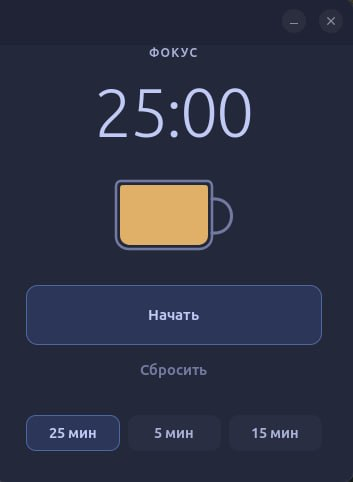

# Brewdoro

[English](README.md)

Brewdoro — небольшой Pomodoro-таймер для Linux на Python, GTK 4 и Libadwaita.
Он не мешает работать и сообщает, когда время закончилось.

<p align="center">
  
</p>

## Возможности

- Фокус-сессия на 25 минут
- Короткий перерыв на 5 минут и длинный на 15
- Пауза, продолжение и сброс
- Системные уведомления и звук завершения
- Анимированная чашка кофе, которая следует за таймером
- Интерфейс на русском, английском и упрощённом китайском

## Установка через Flatpak

Установите `flatpak` и `flatpak-builder`, затем выполните:

```bash
flatpak remote-add --if-not-exists flathub \
  https://dl.flathub.org/repo/flathub.flatpakrepo
flatpak install flathub org.gnome.Platform//50 org.gnome.Sdk//50

git clone https://github.com/coreharbor/brewdoro.git
cd brewdoro
flatpak-builder --user --install --force-clean \
  .flatpak-build flatpak/ru.brewdoro.timer.yml
flatpak run ru.brewdoro.timer
```

Flatpak-пакет умеет показывать уведомления и воспроизводить звук. Доступа к сети
и личным файлам у него нет.

## Запуск из исходников на Ubuntu 24.04+

```bash
sudo apt update
sudo apt install python3 python3-venv python3-gi python3-cairo python3-gi-cairo \
  gir1.2-gtk-4.0 gir1.2-adw-1

git clone https://github.com/coreharbor/brewdoro.git
cd brewdoro
python3 -m venv --system-site-packages .venv
source .venv/bin/activate
python -m pip install --editable .
make install-user
brewdoro
```

## Разработка

Все проверки запускаются одной командой:

```bash
make check
```

Модель таймера не зависит от GTK, поэтому её тестам не нужна графическая сессия.

## Лицензия

[MIT](LICENSE)
