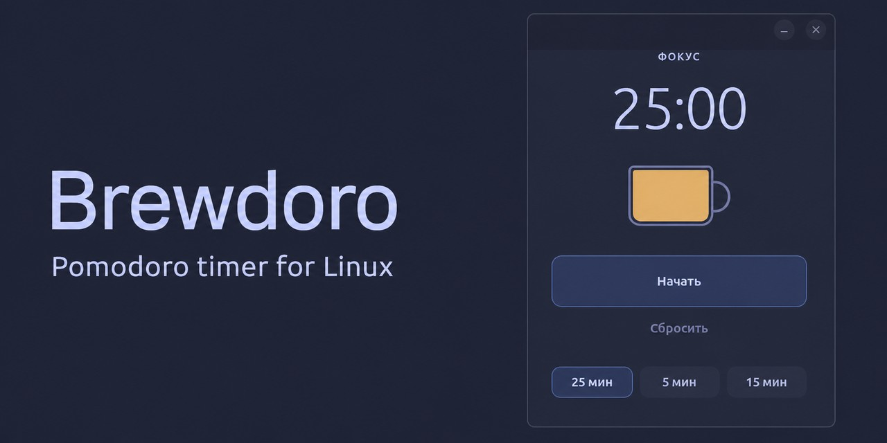
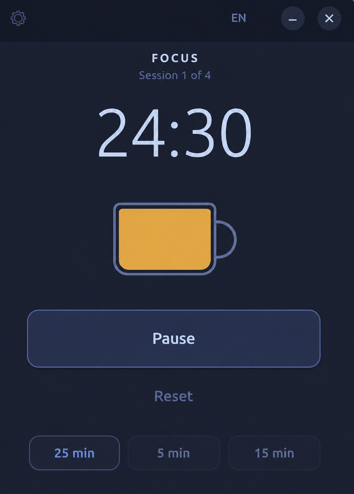

<div align="center">

# ☕ Brewdoro

**Минималистичный Pomodoro-таймер для Linux с анимированной чашкой кофе.**

**Фокус. Кофе. Повторить.**

<br>



</div>

## О проекте

**Brewdoro** — небольшой Pomodoro-таймер для рабочего стола Linux, который не отвлекает от работы.

Вместо обычной полосы прогресса здесь чашка кофе. Во время фокус-сессии кофе постепенно заканчивается, а на перерыве чашка снова наполняется.

Никаких аккаунтов и лишних экранов. Только таймер, чашка кофе и ваша работа.

## ✨ Возможности

- ☕ Анимированная чашка кофе показывает прогресс таймера
- 🎯 Фокус-сессии и перерывы
- 🔁 Цикл Pomodoro с отслеживанием сессий
- 🌙 Минималистичный тёмный интерфейс
- 🐧 Приложение создано специально для Linux
- 🎨 Нативный интерфейс на GTK 4 и Libadwaita
- 🌍 Русский, английский и упрощённый китайский языки
- ⚡ Быстрый запуск и ничего лишнего

## 📸 Скриншот

<div align="center">



</div>

## 📦 Установка

### Flatpak

Brewdoro пока нет во Flathub, но приложение можно собрать и установить локально.

Сначала установите среду и SDK:

```bash
flatpak install flathub org.gnome.Platform//50 org.gnome.Sdk//50
```

Клонируйте репозиторий:

```bash
git clone https://github.com/coreharbor/brewdoro.git
cd brewdoro
```

Соберите и установите приложение:

```bash
flatpak-builder --user --install --force-clean build-dir flatpak/ru.brewdoro.timer.yml
```

Запустите Brewdoro:

```bash
flatpak run ru.brewdoro.timer
```

## 🚀 Использование

Откройте Brewdoro и нажмите **«Начать»**.

Во время фокус-сессии кофе постепенно исчезает из чашки по мере приближения таймера к нулю. На перерыве чашка наполняется снова.

Работайте, отдыхайте и повторяйте цикл.

## 🛠️ Технологии

Brewdoro использует:

- **Python**
- **GTK 4**
- **Libadwaita**
- **Flatpak**

Brewdoro должен оставаться небольшим, быстрым и удобным приложением, которое естественно выглядит на современном рабочем столе Linux.

## 🌍 Переводы

Сейчас Brewdoro поддерживает:

- 🇷🇺 Русский
- 🇬🇧 Английский
- 🇨🇳 Упрощённый китайский

Другие переводы приветствуются.

Читайте также [README на английском](README.md).

## 🧑‍💻 Разработка

Клонируйте репозиторий:

```bash
git clone https://github.com/coreharbor/brewdoro.git
cd brewdoro
```

Исходный код находится в [`src/brewdoro/`](src/brewdoro/).

Файлы сборки Flatpak — в [`flatpak/`](flatpak/).

Метаданные приложения и файлы интеграции с рабочим столом — в [`data/`](data/).

## 🤝 Участие в разработке

Нашли ошибку, придумали полезное улучшение или хотите помочь с переводом? Создайте issue или отправьте pull request.

## ⭐ Поддержать Brewdoro

Если Brewdoro оказался полезен, поставьте репозиторию звезду. Так проект смогут найти больше пользователей Linux.

<div align="center">

☕ **Фокус. Кофе. Повторить.**

</div>
